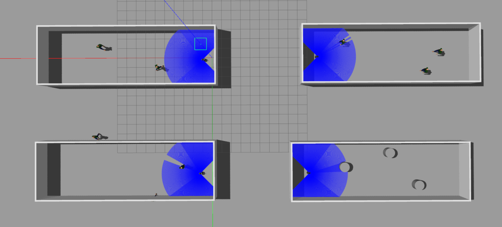
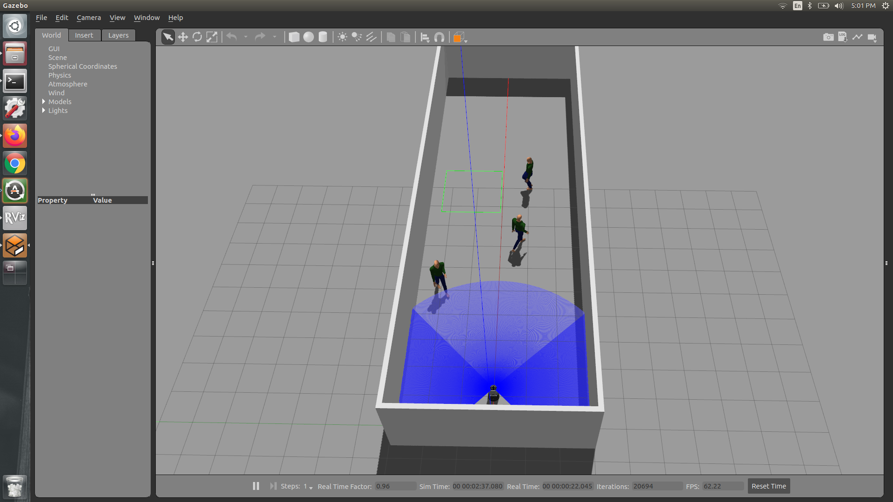
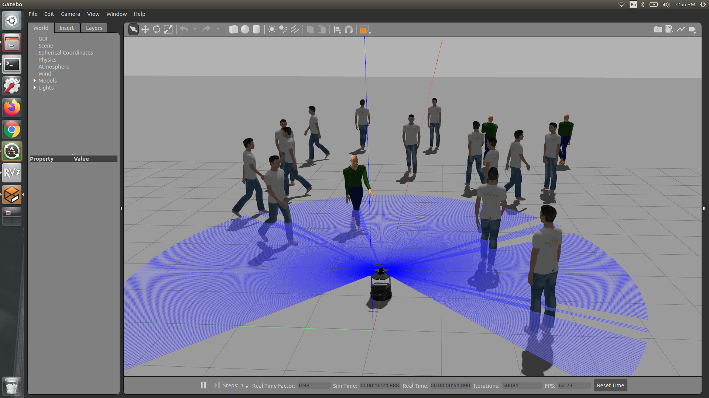

# HybridReinforcementLearning
Package that combines reinforcement learning with Dynamic Window Approach 

## Training iterations 

1) Trained wirth discretized lidar data and policy converged to a stable reward value

2) Traind with DWA costs as input and rewarded for going towards goal and reaching the goal. It was penalized for colliding, diverging from goal and choosing velocities those are not feasible. In this case the model never converged. It might be because of the dynamic nature of the observations and the action space. 

3) In the 3rd iteration, I am sorting the DWA costs so that the network will have a structured input. This training also did not converge. 

4) Now rewarding the robot for going towards goal, executing velocity with linear component. and penalizing for colliding with something. 

Different training scenarios


## Instructions to run the Code

Initial setup  instructions	
```
git clone https://github.com/NithishkumarS/DWA-RL.git
cd DWA-RL
rosdep install --from-paths src --ignore-src -r -y
catkin_make
```

Once the dependencies are satisfied and after build is created, launch the training environment
```
roslaunch hybrid_rl_training 4_robot_3D1P.launch
```
Create a virtual environment with the requirements.txt

To start the training, activate the virtual environment
```
cd hybrid_rl_training/src
python stable_baselines.py <world-file-name> <Number-of-robots-to-train>
```

Sample scenario
```
python stable_baselines.py 4_robot_3D1P 2
```


To test the trained model in a gazebo world
```
cd hybrid_rl_training/src
python test_trained_model.py <world-file-name> <Number-of-robots-to-train> <robot-id-topic-name>
```

Sample scenario
```
python test_trained_model.py zigzag_3ped 1 0
```

Test scenarios




Link to the video [](https://www.youtube.com/watch?v=iuPs5BPgbCI&feature=youtu.be).

## Citation 
If you find this repository useful, please cite us.

> U. Patel, N. K. S. Kumar, A. J. Sathyamoorthy, and D. Manocha,  
> *"DWA-RL: Dynamically Feasible Deep Reinforcement Learning Policy for Robot Navigation among Mobile Obstacles,"*  
> 2021 IEEE International Conference on Robotics and Automation (ICRA), Xi'an, China, 2021, pp. 6057-6063.  
> DOI: [10.1109/ICRA48506.2021.9561462](https://doi.org/10.1109/ICRA48506.2021.9561462)  